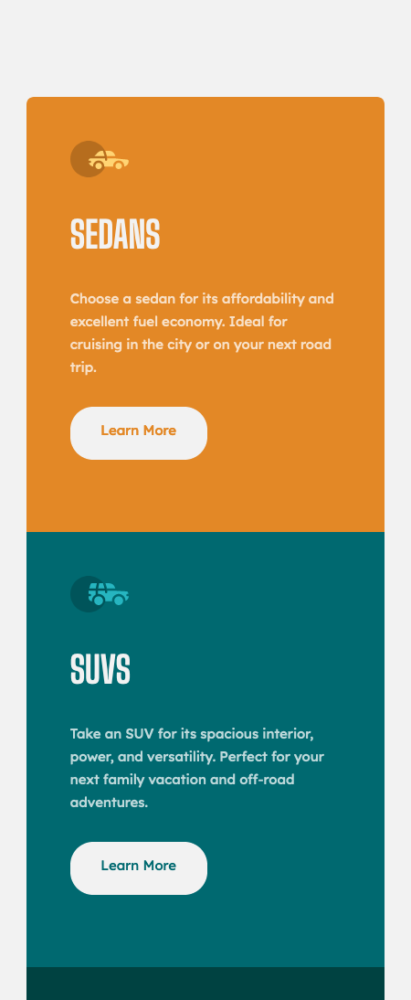

# Frontend Mentor - 3-column preview card component solution

This is a solution to the [3-column preview card component challenge on Frontend Mentor](https://www.frontendmentor.io/challenges/3column-preview-card-component-pH92eAR2-). Frontend Mentor challenges help you improve your coding skills by building realistic projects. 

## Table of contents

- [Overview](#overview)
  - [The challenge](#the-challenge)
  - [Screenshot](#screenshot)
  - [Links](#links)
- [My process](#my-process)
  - [Built with](#built-with)
  - [What I learned](#what-i-learned)
  - [Continued development](#continued-development)
  - [Useful resources](#useful-resources)
- [Author](#author)
- [Acknowledgments](#acknowledgments)

**Note: Delete this note and update the table of contents based on what sections you keep.**

## Overview

### The challenge

Users should be able to:

- View the optimal layout depending on their device's screen size
- See hover states for interactive elements

### Screenshot



### Links

- Solution URL: [https://github.com/norman02/FM-3-column-preview-card-component](https://github.com/norman02/FM-3-column-preview-card-component)
- Live Site URL: [https://fm-3-column-preview-card-component-delta.vercel.app/](https://fm-3-column-preview-card-component-delta.vercel.app/)

## My process

### Built with

- CSS custom properties
- CSS Grid
- Mobile-first workflow
- JavaScript
- Sass

### What I learned

This was simple layout practice. My main goal here was a naive content management system using the map function.
```js
const renderHome = () => {
    const home = document.querySelector('.home')
    home.innerHTML = cars.map(car => {
        return (
            `<section class="${car.id}">
            
            <h2>${car.type}</h2>
            <p>${car.description}<p>
            <a href="#" class="btn btn--${car.id}">Learn More</a>
            </section>`
        )
    }).join('');
}
```

### Continued development

I am currently reviewing JavaScript and learning React. I plan to refactor this and other projects to use the React framework.


### Useful resources

- [Learn JavaScript](https://learnjavascript.online/) - I like this course because it focuses on web development at every stage of studying JavaScript. I learned JavaScript through Codecademy but some concepts didn't stick. I have found that this course does a better job of reinforcing the concepts.

## Author

- Frontend Mentor - [@norman02](https://www.frontendmentor.io/profile/norman02)
- Twitter - [@JohnIsNorman](https://www.twitter.com/JohnIsNorman)